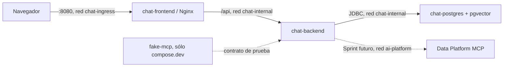

# AI Data Chat

Aplicacion de chat con IA orientada a datos, actualmente completada hasta Sprint 1. Este repositorio es un monorepo con backend Spring Boot, frontend Angular, PostgreSQL con pgvector y dobles de prueba deterministas. La especificacion principal es [`AI_DATA_CHAT_PROMPT.md`](AI_DATA_CHAT_PROMPT.md).

> Alcance actual: infraestructura, identidad, registro, primer administrador, sesiones, roles y administracion de usuarios. No hay chat funcional, proveedores reales, RAG ni integracion remota con Data Platform MCP. Esas capacidades pertenecen a sprints posteriores.

## Componentes

- `backend/`: monolito modular Java 21 con arquitectura hexagonal, Spring Security, Spring Session JDBC, Actuator, Flyway y adaptadores fake.
- `frontend/`: aplicacion Angular en espanol con flujos de acceso y panel administrativo.
- `deployment/nginx/`: hosting estático, proxy de `/api`, configuración preparada para SSE y headers de seguridad.
- `test-support/fake-mcp/`: servidor contractual WireMock con únicamente `health_check` y `hello_world`.
- `docs/`: arquitectura, seguridad, integraciones y ADRs.



`chat-frontend` es el único servicio en `chat-ingress`; sólo `chat-backend` pertenece a `chat-internal` y a la red externa `ai-platform`. PostgreSQL no publica puertos al host.

## Requisitos

- Docker Engine 27+ con Compose v2.
- Para desarrollo sin contenedores: JDK 21–26, Maven Wrapper y Node `^22.22.3`, `^24.15.0` o `^26.0.0`.
- La red Docker externa `ai-platform`.

Las versiones seleccionadas y sus fuentes oficiales están en [`docs/versions.md`](docs/versions.md).

## Arranque

```bash
cp .env.example .env
# Sustituye POSTGRES_PASSWORD por un valor local fuerte.
./scripts/ensure-network.sh
docker compose up --build --wait
```

La UI queda en <http://localhost:8080>. Comprobaciones rápidas:

```bash
curl --fail http://localhost:8080/healthz
curl --fail http://localhost:8080/api/system/status
docker compose ps
```

Al entrar por primera vez, la UI solicita crear la cuenta inicial. La base de datos asigna `ADMIN`
atomicamente a una sola cuenta, incluso ante registros concurrentes. Los registros posteriores son
`USER`. Para cerrar el registro publico despues del bootstrap:

```dotenv
ALLOW_PUBLIC_REGISTRATION=false
```

Para añadir el MCP contractual de pruebas:

```bash
docker compose -f compose.yaml -f compose.dev.yaml up --build --wait
```

El backend continua usando LLM y MCP fake en Sprint 1. El contenedor WireMock permite validar el contrato por separado y nunca toca una base de datos real.

Para detener el entorno sin borrar datos:

```bash
docker compose down
```

## Calidad y pruebas

Backend:

```bash
cd backend
./mvnw -B -ntp verify
```

Incluye pruebas unitarias de fakes, reglas ArchUnit y pruebas Testcontainers sobre PostgreSQL/pgvector real para migraciones, identidad y concurrencia del primer administrador.

Frontend:

```bash
cd frontend
npm ci
npm run format:check
npm run lint
npm run test:ci
npm run build
```

Las pruebas de navegador de registro inicial y login se ejecutan con `npm run e2e`; requieren instalar Chromium mediante Playwright. La integracion continua replica formato, lint, pruebas, builds y auditoria de dependencias con severidad alta.

## Configuración

`.env.example` contiene solo marcadores. Las variables de identidad y sesiones ya son funcionales; cifrado, uploads y rondas de tools siguen reservadas para sus sprints.

Las integraciones se ejecutan con `APP_INTEGRATIONS_MODE=fake`. No se aceptan credenciales ni se invocan APIs LLM pagadas.

En produccion deben configurarse `SESSION_COOKIE_SECURE=true` y `CSRF_COOKIE_SECURE=true`, servir
la aplicacion exclusivamente por HTTPS y conservar el proxy mismo-origen. Consulta
[Identidad](docs/identity.md) y [Seguridad](docs/security.md).

## Documentación

- [Arquitectura](docs/architecture.md)
- [Seguridad](docs/security.md)
- [Identidad y API](docs/identity.md)
- [Proveedores](docs/providers.md)
- [Integración MCP](docs/mcp-integration.md)
- [RAG](docs/rag.md)
- [Decisiones ADR](docs/adr/README.md)
- [Tareas](TASKS.md)
- [Cambios](CHANGELOG.md)

## Estado del roadmap

Sprint 0 y Sprint 1 estan implementados. Sprint 2 (proveedores y modelos) no debe comenzar sin aprobacion explicita del propietario del proyecto.
