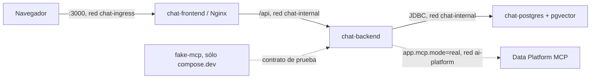

# AI Data Chat

Aplicacion de chat con IA orientada a datos, actualmente completada hasta Sprint 4. Este repositorio es un monorepo con backend Spring Boot, frontend Angular, PostgreSQL con pgvector y dobles de prueba deterministas. La especificacion principal es [`AI_DATA_CHAT_PROMPT.md`](AI_DATA_CHAT_PROMPT.md).

> Alcance actual: infraestructura, identidad, usuarios, conexiones LLM cifradas, chat persistente con streaming/cancelacion, cliente MCP Streamable HTTP real y tool calling multi-proveedor (OpenAI y Anthropic) orquestado por el backend. RAG pertenece a sprints posteriores.

## Componentes

- `backend/`: monolito modular Java 21 con arquitectura hexagonal, seguridad, conversaciones y adaptadores LLM tras puertos propios.
- `frontend/`: aplicacion Angular en espanol con identidad, administracion, proveedores y experiencia completa de chat.
- `deployment/nginx/`: hosting estático, proxy de `/api`, configuración preparada para SSE y headers de seguridad.
- `test-support/fake-mcp/`: servidor contractual WireMock con únicamente `health_check` y `hello_world`.
- `docs/`: arquitectura, seguridad, integraciones y ADRs.



`chat-frontend` es el único servicio en `chat-ingress`; sólo `chat-backend` pertenece a `chat-internal` y a la red externa `ai-platform`. PostgreSQL no publica puertos al host.

## Requisitos

- Docker Engine 27+ con Compose v2.
- Para desarrollo sin contenedores: JDK 21–26, Maven Wrapper y Node `^22.22.3`, `^24.15.0` o `^26.0.0`.
- La red Docker externa `ai-platform`.

Las versiones seleccionadas y sus fuentes oficiales están en [`docs/versions.md`](docs/versions.md).

## Arranque

```bash
cp .env.example .env
# Sustituye POSTGRES_PASSWORD y genera CREDENTIAL_MASTER_KEY.
# openssl rand -base64 32
./scripts/ensure-network.sh
docker compose up --build --wait
```

La UI queda en <http://localhost:3000>. Comprobaciones rápidas:

```bash
curl --fail http://localhost:3000/healthz
curl --fail http://localhost:3000/api/system/status
docker compose ps
```

Al entrar por primera vez, la UI solicita crear la cuenta inicial. La base de datos asigna `ADMIN`
atomicamente a una sola cuenta, incluso ante registros concurrentes. Los registros posteriores son
`USER`. Para cerrar el registro publico despues del bootstrap:

```dotenv
ALLOW_PUBLIC_REGISTRATION=false
```

Para ejercitar el cliente MCP real contra el doble contractual WireMock:

```bash
docker compose -f compose.yaml -f compose.dev.yaml up --build --wait
```

Este overlay activa `MCP_INTEGRATION_MODE=real` mientras conserva `APP_INTEGRATIONS_MODE=fake`, así
el proveedor LLM `FAKE` gratuito sigue disponible; ambos flags son independientes. Para LLM, la UI
permite configurar el fake determinista o conexiones OpenAI, Anthropic, BytePlus, MiniMax,
OpenAI-compatible y Ollama. Ninguna prueba automatizada consume APIs pagadas ni el MCP real de
Data Platform; probar
una conexion real sólo ocurre por accion explícita del usuario.

## Chat y streaming

Abre <http://localhost:3000/chat>. Cada conversacion y cada consulta se filtran por el usuario
autenticado. La UI permite crear, buscar, renombrar y eliminar conversaciones, cambiar el modelo
para mensajes futuros, regenerar, copiar y detener una respuesta. Los mensajes anteriores conservan
el snapshot de proveedor/modelo, uso, `finishReason` y request ID que corresponda.

El backend normaliza streaming de OpenAI Responses, Anthropic Messages, BytePlus/MiniMax/OpenAI Chat
Completions, proveedores compatibles y Ollama. Para una prueba local sin coste configura el proveedor
`FAKE`, sincroniza `fake-chat-v1` y selecciónalo como predeterminado. La respuesta llega por SSE y el
mensaje parcial se persiste como `CANCELLED` si el usuario detiene la generación o el navegador se
desconecta.

Con una conexion OpenAI o Anthropic real y `app.mcp.mode=real`, el chat ofrece tool calling: el
backend descubre el catalogo de tools del MCP, valida cada llamada contra ese catalogo, la ejecuta
en un executor dedicado con timeout y límite de tamaño, y muestra una tarjeta por cada tool call con
su estado. El panel de solo lectura en `/settings/mcp` muestra el estado `UP`/`DEGRADED`/`DOWN`, el
contrato negociado y las funciones disponibles. Consulta [Chat y streaming](docs/chat.md) y
[Integración MCP](docs/mcp-integration.md) para la API y el ciclo de estados.

## Proveedores y modelos

Abre <http://localhost:3000/settings/providers> después de iniciar sesion. Cada conexion pertenece
al usuario autenticado. Las claves se cifran con AES-256-GCM y la API sólo devuelve una pista
enmascarada.

OpenAI-compatible y Ollama necesitan una allowlist del operador. Ejemplo para Ollama en la red
Docker:

```dotenv
PROVIDER_ALLOWED_HOSTS=ollama
PROVIDER_ALLOWED_HTTP_HOSTS=ollama
```

Con allowlist vacía se bloquean todos los destinos configurables. BytePlus admite actualmente la
region oficial documentada `ap-southeast-1` y requiere un model ID o endpoint ID configurado.
MiniMax usa por defecto `https://api.minimax.io/v1` (sin allowlist, igual que OpenAI/Anthropic) y
también requiere un model ID configurado, ya que no publica un catálogo de modelos. Opcionalmente
se puede indicar un Base URL propio (p. ej. el endpoint regional de China `api.minimaxi.com`), que
en ese caso sí debe estar en `PROVIDER_ALLOWED_HOSTS`/`PROVIDER_ALLOWED_HTTP_HOSTS`, igual que
OpenAI-compatible y Ollama.

Para detener el entorno sin borrar datos:

```bash
docker compose down
```

## Calidad y pruebas

Backend:

```bash
cd backend
./mvnw -B -ntp verify
```

Incluye pruebas unitarias de cifrado, SSRF, fakes y contratos HTTP/streaming, reglas ArchUnit y
pruebas Testcontainers sobre PostgreSQL/pgvector real para migraciones, identidad, concurrencia,
ownership de proveedores/conversaciones, persistencia de uso y cancelacion parcial.

Frontend:

```bash
cd frontend
npm ci
npm run format:check
npm run lint
npm run test:ci
npm run build
```

Las pruebas de navegador de registro inicial, login, proveedor fake, chat SSE, panel MCP y tarjetas
de tool call se ejecutan con `npm run e2e`; requieren instalar Chromium mediante
`npx playwright install chromium`. La integracion continua replica formato, lint, pruebas, builds y
auditoria de dependencias con severidad alta.

## Configuración

`.env.example` contiene sólo marcadores. `CREDENTIAL_MASTER_KEY` es obligatoria, debe ser base64 de
32 bytes y no debe persistirse en Git. `CREDENTIAL_KEY_VERSION` queda almacenada con cada secreto.

`APP_INTEGRATIONS_MODE=fake` conserva el proveedor LLM determinista; `MCP_INTEGRATION_MODE=fake`
(independiente) conserva el MCP determinista. Las credenciales reales sólo se descifran en backend
durante una accion explícita de su propietario, incluida una generacion. `CHAT_*` limita timeout,
heartbeat, historial enviado y longitud máxima de respuesta; `MAX_TOOL_ROUNDS` y
`MAX_TOOL_RESULT_BYTES` acotan la orquestacion de tool calling.

En produccion deben configurarse `SESSION_COOKIE_SECURE=true` y `CSRF_COOKIE_SECURE=true`, servir
la aplicacion exclusivamente por HTTPS y conservar el proxy mismo-origen. Consulta
[Identidad](docs/identity.md) y [Seguridad](docs/security.md).

## Documentación

- [Arquitectura](docs/architecture.md)
- [Seguridad](docs/security.md)
- [Identidad y API](docs/identity.md)
- [Proveedores](docs/providers.md)
- [Chat y streaming](docs/chat.md)
- [Integración MCP](docs/mcp-integration.md)
- [RAG](docs/rag.md)
- [Decisiones ADR](docs/adr/README.md)
- [Tareas](TASKS.md)
- [Cambios](CHANGELOG.md)

## Estado del roadmap

Sprint 0, Sprint 1, Sprint 2, Sprint 3 y Sprint 4 (MCP remoto y tool calling) estan implementados.
Sprint 5+ (RAG) no debe comenzar sin aprobacion explicita del propietario del proyecto.
