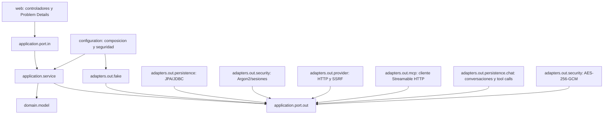
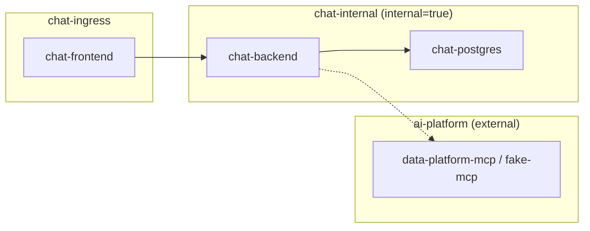
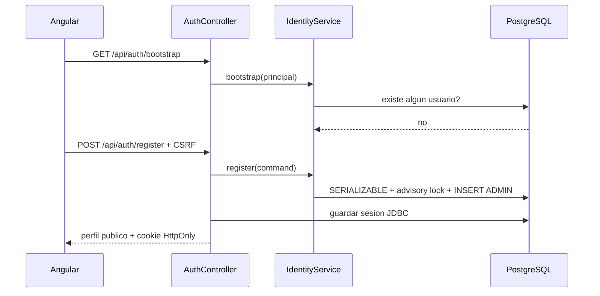
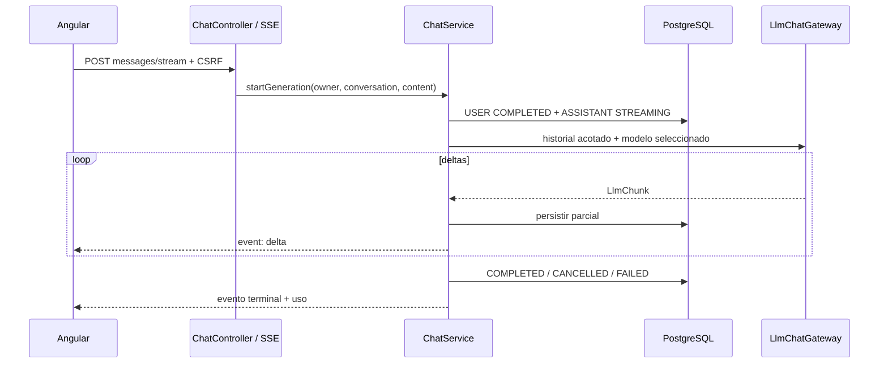
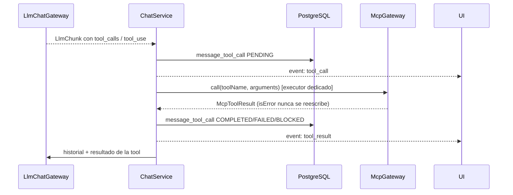

# Arquitectura

## Contexto y alcance

Sprint 4 mantiene un monolito modular desplegable. Los limites internos permiten cambiar persistencia e integraciones sin acoplar dominio y casos de uso a Spring, SDKs de proveedores o MCP.

Reglas verificadas con ArchUnit:

- `domain` no depende de `application`, `adapters`, `configuration`, `infrastructure` ni `web`.
- `application` no depende de adaptadores, infraestructura o web.
- Los contratos externos se expresan mediante puertos propios.

## Puertos preparados

`LlmProviderPort`, `ModelCatalogPort`, `McpGateway`, `EmbeddingProviderPort`, `DocumentStoragePort`, `VectorSearchPort`, `CredentialCipherPort`, `ConversationRepository`, `DocumentRepository` y `AuditRepository`.

Sprint 1 anadio puertos de identidad y sesiones. Sprint 2 activo proveedores y cifrado. Sprint 3
activa `ChatUseCase`, `ConversationRepository` y `LlmChatGateway`: el caso de uso controla ownership,
historial, estados y auditoria; JPA controla orden/concurrencia; los adaptadores traducen streams
externos a `LlmChunk`. Sprint 4 anade `adapters/out/mcp/` (cliente Streamable HTTP real,
seleccionable junto al fake vía `app.mcp.mode`) y la orquestacion de tool calling en `ChatService`
para OpenAI y Anthropic (ver ADR-0009); documentos y vectores siguen sin capacidad funcional.

## Contenedores y redes

- Nginx es la única entrada HTTP, pertenece a `chat-ingress` y mantiene un mismo origen.
- PostgreSQL se limita a la red interna y a un volumen nombrado.
- Sólo backend conecta `chat-internal` con la red externa `ai-platform`.
- `compose.dev.yaml` agrega `fake-mcp` a `ai-platform`; no modifica Data Platform MCP.

## Datos

Flyway crea la extension `vector`, namespaces delimitados, identidad, sesiones, auditoria,
proveedores y `chat.conversation`/`chat.message`. El schema `rag` sigue vacio. JPA usa
`ddl-auto=validate`; Flyway es la unica autoridad de esquema. Un indice parcial impide dos mensajes
de asistente `STREAMING` para la misma conversacion y un lock pesimista asigna posiciones estables.

## Flujo disponible

Tambien estan disponibles login/logout, administracion y proveedores propios. En chat, Spring MVC
expone `SseEmitter`; un publisher de aplicacion persiste cada parcial, normaliza eventos terminales y
cancela el upstream si el navegador desaparece. Cada mensaje del asistente conserva el snapshot con
el que se genero. Las pruebas usan dobles y servidores locales; ninguna invoca APIs pagadas.

Para OpenAI y Anthropic, si el modelo pide una tool, `ChatService` no delega la conexion MCP al
proveedor: valida el nombre contra el catalogo descubierto, ejecuta la llamada en un executor
dedicado y reinyecta el resultado como un nuevo turno antes de continuar el mismo stream.

