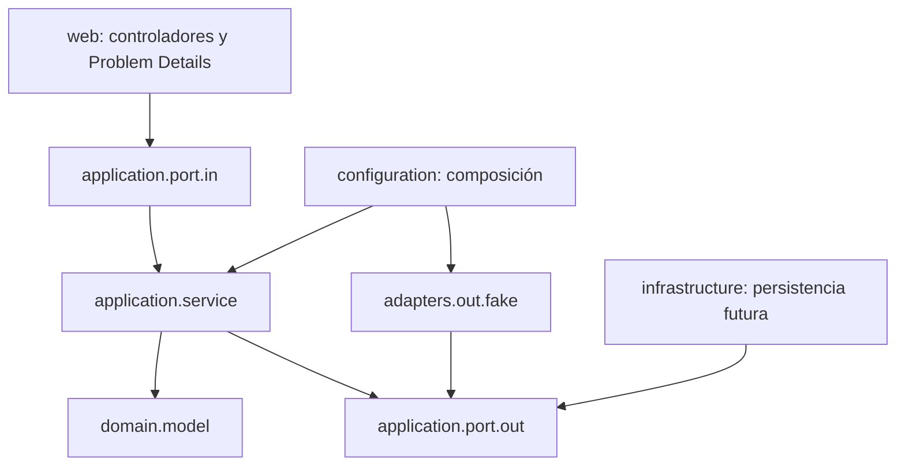
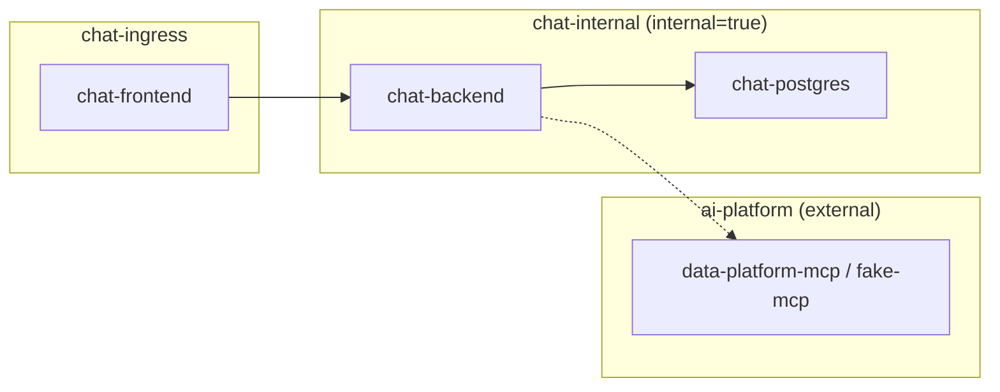

# Arquitectura

## Contexto y alcance

Sprint 0 entrega un monolito modular desplegable, no microservicios funcionales. Los límites internos permiten cambiar adaptadores sin acoplar dominio y casos de uso a Spring AI, SDKs de proveedores o MCP.

Reglas verificadas con ArchUnit:

- `domain` no depende de `application`, `adapters`, `configuration`, `infrastructure` ni `web`.
- `application` no depende de adaptadores, infraestructura o web.
- Los contratos externos se expresan mediante puertos propios.

## Puertos preparados

`LlmProviderPort`, `ModelCatalogPort`, `McpGateway`, `EmbeddingProviderPort`, `DocumentStoragePort`, `VectorSearchPort`, `CredentialCipherPort`, `ConversationRepository`, `DocumentRepository` y `AuditRepository`.

Sólo `LlmProviderPort`, `ModelCatalogPort` y `McpGateway` tienen adaptadores fake en Sprint 0. El resto es una frontera de compilación, no una capacidad implementada.

## Contenedores y redes

- Nginx es la única entrada HTTP, pertenece a `chat-ingress` y mantiene un mismo origen.
- PostgreSQL se limita a la red interna y a un volumen nombrado.
- Sólo backend conecta `chat-internal` con la red externa `ai-platform`.
- `compose.dev.yaml` agrega `fake-mcp` a `ai-platform`; no modifica Data Platform MCP.

## Datos

Flyway crea la extensión `vector` y los namespaces `identity`, `chat`, `rag` y `audit`. No crea tablas funcionales porque corresponderían a sprints posteriores. JPA usa `ddl-auto=validate`; Flyway es la única autoridad de esquema.

## Flujo disponible

El único flujo web de producto es `GET /api/system/status`: el controlador llama al caso de uso, que consulta los puertos fake y devuelve su estado declarado. No transmite chats ni llama servicios externos.
