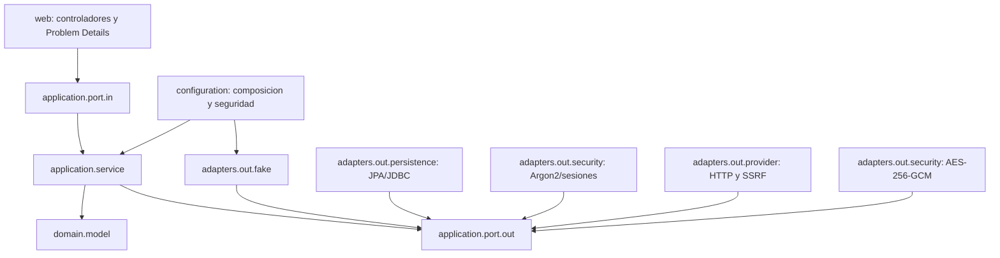
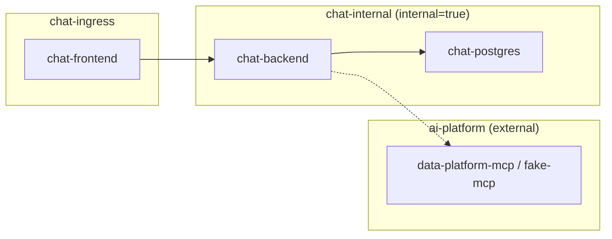
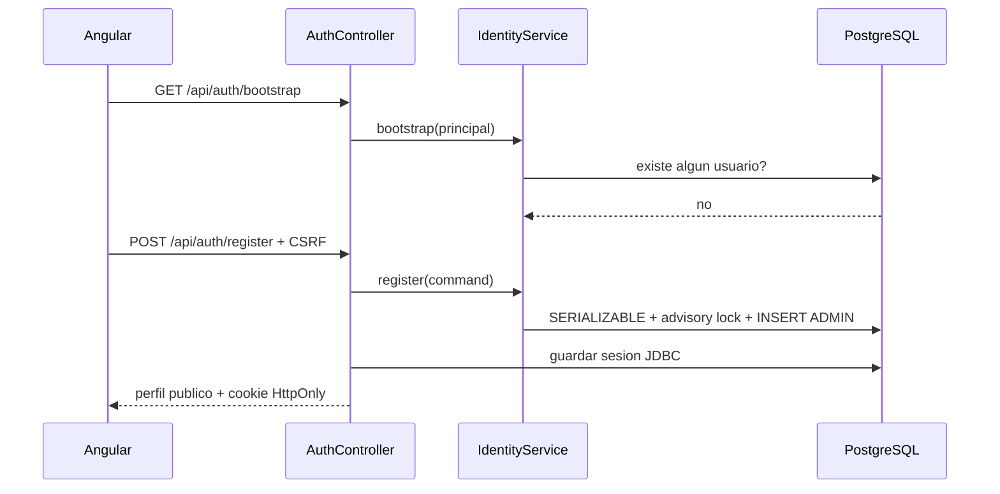

# Arquitectura

## Contexto y alcance

Sprint 2 mantiene un monolito modular desplegable. Los limites internos permiten cambiar persistencia e integraciones sin acoplar dominio y casos de uso a Spring, SDKs de proveedores o MCP.

Reglas verificadas con ArchUnit:

- `domain` no depende de `application`, `adapters`, `configuration`, `infrastructure` ni `web`.
- `application` no depende de adaptadores, infraestructura o web.
- Los contratos externos se expresan mediante puertos propios.

## Puertos preparados

`LlmProviderPort`, `ModelCatalogPort`, `McpGateway`, `EmbeddingProviderPort`, `DocumentStoragePort`, `VectorSearchPort`, `CredentialCipherPort`, `ConversationRepository`, `DocumentRepository` y `AuditRepository`.

Sprint 1 anadio `UserAccountRepository`, `IdentityTransactionPort`, `PasswordHashPort` y
`SessionInvalidationPort`. Sprint 2 activa `LlmProviderPort`, `CredentialCipherPort` y
`ProviderConnectionRepository` con adaptadores OpenAI, Anthropic, BytePlus, OpenAI-compatible,
Ollama y fake. MCP conserva exclusivamente el adaptador fake; chat, documentos y vectores siguen
sin capacidad funcional.

## Contenedores y redes

- Nginx es la única entrada HTTP, pertenece a `chat-ingress` y mantiene un mismo origen.
- PostgreSQL se limita a la red interna y a un volumen nombrado.
- Sólo backend conecta `chat-internal` con la red externa `ai-platform`.
- `compose.dev.yaml` agrega `fake-mcp` a `ai-platform`; no modifica Data Platform MCP.

## Datos

Flyway crea la extension `vector`, namespaces delimitados, identidad, sesiones, auditoria y las
tablas `chat.provider_connection` y `chat.provider_model`. El schema `rag` sigue vacio. JPA usa
`ddl-auto=validate`; Flyway es la unica autoridad de esquema.

## Flujo disponible

Tambien estan disponibles login/logout, perfil, administracion de usuarios y gestion de conexiones
y modelos propios. El endpoint de estado se conserva. Ningun flujo transmite chats; las pruebas
usan dobles y servidores locales, y una prueba real sólo ocurre por accion explícita del usuario.
